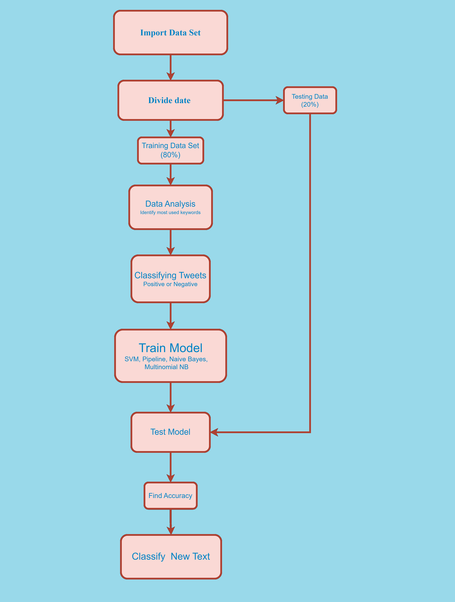
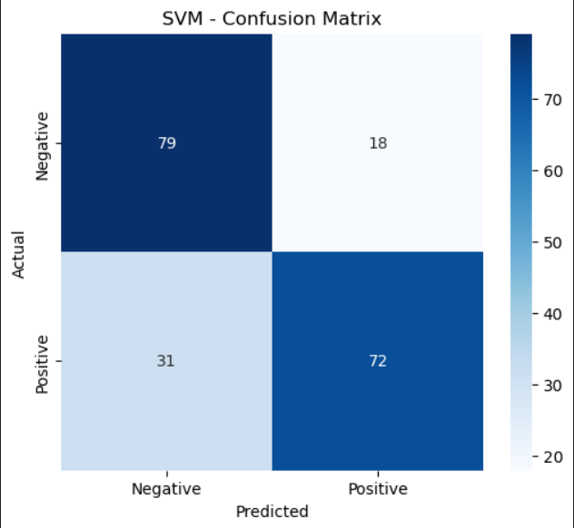
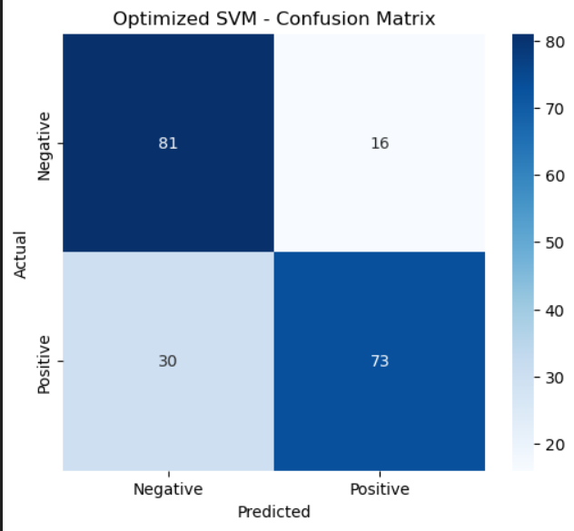
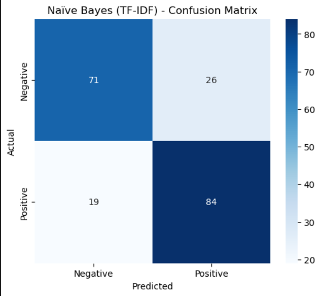
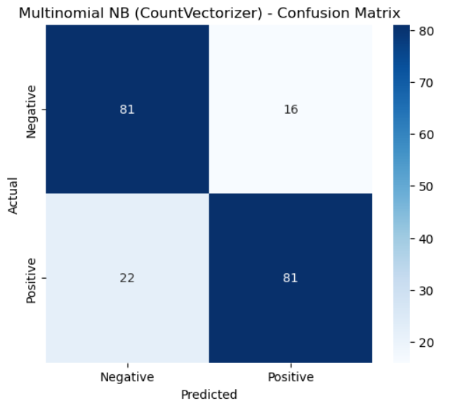

# Sentiment Analysis Report

## Abstract
Sentiment analysis plays a crucial role in Natural Language Processing (NLP) by classifying text into positive or negative sentiments. This project presents a study on sentiment classification using **Support Vector Machine (SVM)**, **Optimized SVM Pipeline**, **Naïve Bayes (NB)**, and **Multinomial Naïve Bayes (MultinomialNB)** classifiers. The models are trained on a labeled dataset of customer reviews and evaluated based on accuracy and confusion matrices.

## Introduction
Sentiment analysis is a key technique in NLP, widely used in **customer feedback systems, social media analysis, and brand monitoring**. The objective of this study is to compare the effectiveness of different classification models for sentiment analysis. The dataset comprises **customer reviews labeled as positive (1) or negative (0)**.

Pre-requisites
--------------

- Python
- Machine Learning

## Architecture

1. **Data Collection**: Customer reviews dataset.
2. **Preprocessing**: Text cleaning, tokenization, and vectorization.
3. **Feature Extraction**: TF-IDF and CountVectorizer.
4. **Model Training**: SVM, Optimized SVM Pipeline, Naïve Bayes, and Multinomial Naïve Bayes.
5. **Evaluation**: Accuracy and confusion matrices.

## Data Preprocessing
- **Data Splitting**: 80% training, 20% testing (`train_test_split`).
- **Text Vectorization**:
  - **TF-IDF** (`max_features=5000`) for SVM and Naïve Bayes.
  - **CountVectorizer** for Multinomial Naïve Bayes.

## Methodology
### **Model Architectures**
#### **Support Vector Machine (SVM)**
- Uses `SVC()` for binary classification.
- Standard SVM and optimized SVM with `C=1, kernel='rbf'`.
- Implemented within a pipeline using `make_pipeline()`.

#### **Optimized SVM Pipeline**
- Utilizes `Pipeline()` to integrate TF-IDF and SVM.
- Fine-tuned with `C=1, kernel='rbf'` for improved classification.

#### **Naïve Bayes (MultinomialNB)**
- Implemented with both **TF-IDF and CountVectorizer** features.
- Uses `Naïve Bayes()` for probability-based classification.

#### **Multinomial Naïve Bayes (CountVectorizer)**
- A variation of Naïve Bayes using `CountVectorizer()`.
- Implemented with `MultinomialNB()` classifier.

### **Training Process**
1. **TF-IDF and CountVectorizer preprocessing** for feature extraction.
2. **Model training** using training datasets.
3. **Performance evaluation** using accuracy and confusion matrices.

## Experimental Results
### **Support Vector Machine (SVM)**
- Standard SVM was trained using `SVC()`.
- Model Accuracy: **0.755**.

### **Optimized SVM Pipeline**
- A pipeline was used with **TF-IDF vectorizer and `SVC(C=1, kernel='rbf')`**.
- Accuracy: **0.77**.

### **Naïve Bayes (TF-IDF)**
- Model trained using `Naïve Bayes()` with TF-IDF features.
- Accuracy: **0.775**.

### **Multinomial Naïve Bayes (CountVectorizer)**
- Model trained using `MultinomialNB()` with CountVectorizer.
- Accuracy: **0.81**.

## Performance Comparison
| Model                          | Accuracy  |
|--------------------------------|-----------|
| Standard SVM                   | 0.755     |
| Optimized SVM Pipeline         | 0.77      |
| Naïve Bayes                    | 0.775     |
| Multinomial Naïve Bayes        | 0.81      |

## Confusion Matrices
Confusion matrices for each model are presented below:

1. **SVM**  
   

2. **Optimized SVM Pipeline**  
   

3. **Naïve Bayes (TF-IDF)**  
   

4. **Multinomial Naïve Bayes (CountVectorizer)**  
   

## Conclusion and Future Work
- **Optimized SVM** performed better than the **Standard SVM**, demonstrating the impact of hyperparameter tuning.
- **Naïve Bayes with TF-IDF** performed well, but **Multinomial Naïve Bayes with CountVectorizer** provided slightly different results.
- **Future Enhancements**:
  - **Hyperparameter tuning** for SVM and Naïve Bayes.
  - **Deep learning models** such as LSTMs or transformers for improved accuracy.
  - **Expanding the dataset** for better generalization.

## References
(Add relevant research references here.)

This study establishes a strong baseline for sentiment classification and suggests further enhancements using feature engineering and deep learning.

## Demo

- Name : User
- Password: password

[Sentiment-analysis](http://152.67.165.231:8000/)

## Authors

- [@hemu33662](https://github.com/hemu33662)

